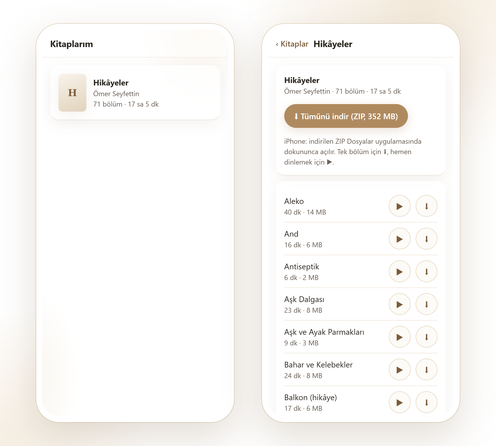
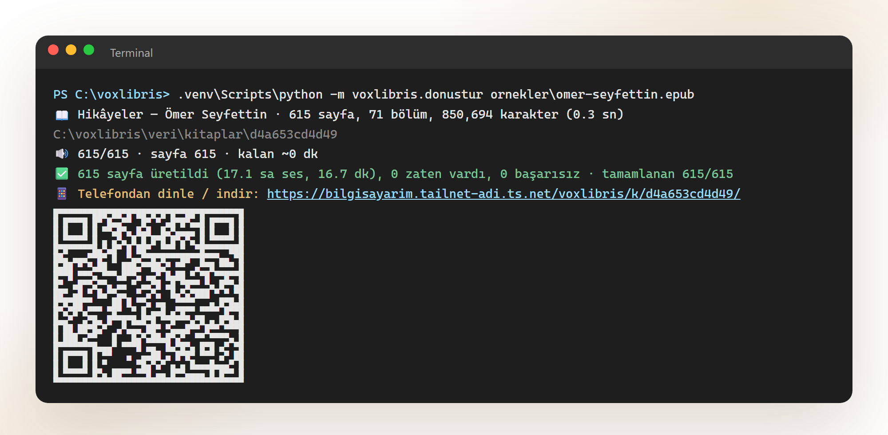
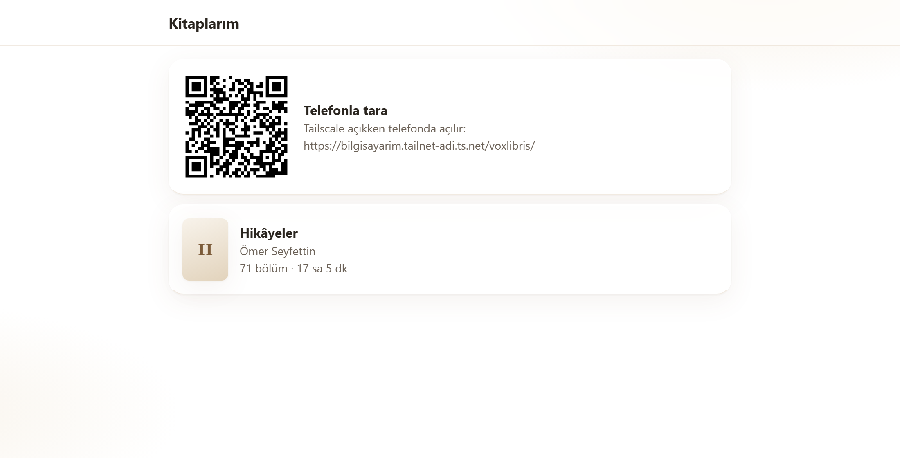

# VoxLibris

*Vox libris — kitapların sesi.*

**Kendi EPUB ve PDF kitaplarını, tamamen kendi bilgisayarında ve ücretsiz olarak sesli kitaba çevir.**
Abonelik, bulut servisi ya da API anahtarı gerekmez. Kitabın metni bilgisayarından hiç çıkmaz.



Testte 475–615 sayfalık kitaplar masaüstü bir işlemcide 12–17 dakikada 12–17 saatlik sese dönüştü. Kitap bölüm bölüm
MP3 olur. Telefondan tek tek bölümleri dinleyebilir, indirebilir ya da tamamını ZIP olarak alabilirsin.

| | |
|---|---|
|  |  |
| Dönüştürme bitince telefon için link ve QR kod | Bilgisayardan açınca telefonla taranacak QR |

## Özellikler

- **EPUB ve PDF:** EPUB'da içindekiler (nav/NCX), PDF'te yer imleri bölüm olur. Taranmış (resim) PDF'ler ve DRM'li
  EPUB'lar açık bir mesajla reddedilir.
- **Temiz metin:** sayfa üst/alt bilgileri, sayfa numaraları, satır sonu tirelemeleri ve dipnot rakamları ayıklanır.
  Ayıklama kurallı koddur; yapay zeka metni değiştirmez ya da uydurmaz.
- **Türkçe okunuş:** kısaltmalar ("Dr.", "vb.", "[ed.n.]"), sıra sayıları ("19. yüzyıl"), Roma rakamları ve kesme
  işaretli sayılar ("1923'te") doğru okunur. Bu düzeltmeler sadece ses motoruna giden kopyaya uygulanır, ekrandaki
  metin değişmez.
- **Sayfa sayfa üretim:** PDF'te fiziksel sayfalar, EPUB'da yaklaşık 1.500 karakterlik sayfalar kullanılır; her
  cümlenin sesteki başlangıç ve bitiş zamanı kaydedilir. Yarıda kesersen aynı komut kaldığı sayfadan devam eder.
- **Telefondan erişim:** küçük bir web sayfası üzerinden bölümleri dinle (▶), indir (⬇) ya da tümünü ZIP olarak al.
  Önerilen yol [Tailscale](https://tailscale.com): internete port açmadan, sadece kendi cihazlarından HTTPS ile.
- **Yerel ses:** [Piper](https://github.com/OHF-Voice/piper1-gpl) ile işlemcide çalışır, ekran kartı gerekmez.

## Kurulum

Gerekenler: Python 3.10+, [ffmpeg](https://ffmpeg.org) (MP3 için; yoksa WAV yazılır).

**Windows**

```powershell
git clone https://github.com/gorkemsandikci/voxlibris.git
cd voxlibris
py -3.12 -m venv .venv
.venv\Scripts\python -m pip install -r requirements.txt
.venv\Scripts\python araclar\sesleri_indir.py          # 3 Türkçe ses → modeller\piper\
winget install Gyan.FFmpeg                             # MP3 için
```

**macOS / Linux** (Windows'ta denendi; macOS/Linux'ta henüz denenmedi)

```bash
git clone https://github.com/gorkemsandikci/voxlibris.git && cd voxlibris
python3 -m venv .venv && .venv/bin/pip install -r requirements.txt
.venv/bin/python araclar/sesleri_indir.py
# ffmpeg: brew install ffmpeg  |  sudo apt install ffmpeg
```

## Kullanım

```powershell
.venv\Scripts\python -m voxlibris.donustur kitabim.epub                     # tüm kitap
.venv\Scripts\python -m voxlibris.donustur kitabim.pdf --ses fettah         # başka ses
.venv\Scripts\python -m voxlibris.donustur kitabim.pdf --sayfalar 1-20      # sadece bazı sayfalar
.venv\Scripts\python -m voxlibris.donustur kitabim.pdf --sadece-metin       # ses üretmeden, sayfalara bölünmüş metni kontrol et
```

Çıktı `veri/kitaplar/<kimlik>/` altında:

- `bolumler/piper-<ses>/001 - <bölüm>.mp3` + `kitap.m3u` — herhangi bir oynatıcıyla dinlenebilir
- `ses/piper-<ses>/0001.mp3` + `0001.json` — sayfa sesi, süre, cümle zamanları
- `kitap.json` — bölümler, sayfalar, cümle konumları

`--json` son satırda makinece okunabilir özet verir (otomasyon için). `--no-bolum-mp3` bölüm dosyalarını üretmez.

### Sesler

| Ses | Cinsiyet | Lisans |
|---|---|---|
| `dfki` (varsayılan) | erkek | CC BY-NC-SA 4.0 — **ticari olmayan kullanım** |
| `fahrettin` | erkek | CC0 |
| `fettah` | erkek | CC0 |

Sesler `araclar/sesleri_indir.py` ile [rhasspy/piper-voices](https://huggingface.co/rhasspy/piper-voices)'tan
indirilir ve repoya dahil değildir. `fahrettin` ve `fettah` resmi listeden kalktığı için eski bir sürümden alınır.
`--hiz 1.2` konuşmayı hızlandırır.

## Telefondan dinleme ve indirme

Sunucu sadece `127.0.0.1:8790`'da dinler; dışarıya kendiliğinden açılmaz.

**Tailscale ile (önerilen):** bilgisayar ve telefonda [Tailscale](https://tailscale.com) açık olsun.

```powershell
powershell -NoProfile -ExecutionPolicy Bypass -File kurulum\sunucu_kur.ps1
```

Bu betik iki şey yapar. Oturum açılınca başlayan bir "VoxLibris-Sunucu" görevi kurar ve `tailscale serve` ile
`https://<bilgisayar>.<tailnet>.ts.net/voxlibris/` yolunu sadece kendi Tailscale ağına açar. Yönetici izni gerekmez,
internete port açılmaz. Tailscale ağındaki başka hesaplar 403 alır. Bundan sonra her dönüştürmenin sonunda kitabın
linki ve QR kodu yazılır.

Geri almak: `Unregister-ScheduledTask VoxLibris-Sunucu -Confirm:$false; tailscale serve --set-path /voxlibris off`

macOS/Linux'ta: `.venv/bin/python -m voxlibris.sunucu &` ve `tailscale serve --bg --set-path /voxlibris http://127.0.0.1:8790`.

**Sadece ev ağında (Tailscale olmadan):** `python -m voxlibris.sunucu --adres 0.0.0.0` → telefondan
`http://<bilgisayarın-yerel-ip'si>:8790/`. ⚠️ Bu modda parola yoktur; aynı Wi-Fi'daki herkes kitaplığı görebilir.
Linkin dönüştürmeden sonra yazılması için `veri/sunucu.json` dosyasına
`{"genel_adres": "http://192.168.1.10:8790/"}` yaz (kendi IP adresinle).

## Nasıl çalışır

```
EPUB / PDF ─► ayrıştır ─► temizle ─► sayfalara böl ─► cümlelere böl ─► okunuş ─► Piper ─► MP3 (ffmpeg)
              stdlib /     kurallı    PDF: fiziksel    Türkçe             sadece           sayfa + bölüm
              pypdfium2               EPUB: ~1.500 kar. kısaltma bilen    motor kopyası
```

| Modül | Görevi |
|---|---|
| `voxlibris/metin/epub.py` | EPUB (sadece stdlib): OPF, okuma sırası, içindekiler, DRM ve zip bombası kontrolü |
| `voxlibris/metin/pdf.py` | PDF (pypdfium2): sayfa metni, yer imleri, paragrafları sayfalar arasında birleştirme |
| `voxlibris/metin/temizle.py` | Üst/alt bilgi (konuma bağlı), tireleme, görünmez karakterler, dipnot rakamları |
| `voxlibris/metin/bol.py` | Türkçe cümle bölme ve sayfalama |
| `voxlibris/metin/okunus.py` | Sayıyı yazıya çevirme, sıra sayıları, kısaltmalar, Roma rakamları |
| `voxlibris/ses/` | Ses motoru (Piper), sayfa sesi + cümle zamanları, MP3 yazma |
| `voxlibris/donustur.py` | Komut satırı; devam edebilen üretim, bölüm MP3'leri |
| `voxlibris/sunucu.py` | İndirme/dinleme sayfası (stdlib HTTP, Range destekli, ZIP) |

Metin katmanı sadece Python standart kütüphanesiyle çalışır.

## Testler

```powershell
.venv\Scripts\python -m unittest discover -s tests -t .
```

Testler sahte bir ses motoru kullanır; Piper ve ses modelleri gerekmez. Gerçek boyutlu test kitabı için
`python araclar/ornek_kitap.py` çalıştır: Ömer Seyfettin'in kamu malı hikâyelerinden yaklaşık 615 sayfalık bir EPUB ve
571 sayfalık bir PDF üretir (kaynak: Vikikaynak, `ornekler/kaynak/`).

## Yol haritası

- [x] Komut satırından EPUB/PDF → sayfa ve bölüm MP3'leri, telefondan indirme sayfası
- [ ] Web oynatıcı: kitap yükleme, kaldığın yerden devam, hız ayarı, uyku zamanlayıcısı, kilit ekranından kontrol
- [ ] Okurken dinleme: çalan cümlenin vurgulanması (cümle zamanları hazır)
- [ ] Aile profilleri, telefona uygulama gibi ekleme (PWA), çevrimdışı indirme
- [ ] Daha doğal ses için GPU motoru (Chatterbox Multilingual denendi: Türkçe çalışıyor ama gerçek zamandan yavaş)
- [ ] Taranmış PDF'ler için OCR

## Katkı

Hata bildirimi ve PR'lar açık. Yanlış okunan bir kelime ya da kısaltma bulursan cümleyi issue olarak yazman yeter;
`tests/test_metin.py`'ye örnek olarak eklenir. Kod ve adlandırma Türkçedir.

## Yasal not

VoxLibris sadece **sana ait, DRM'siz** kitaplar içindir. DRM kırmaz ve kitap indirmez. Ürettiğin sesler kişisel
kullanımındır; telif hakkı süren eserlerin seslerini paylaşma. `dfki` sesi ticari olmayan kullanım lisanslıdır.

## Lisans

Kod [MIT](LICENSE) lisanslıdır. Bağımlılıklar ve ses modelleri kendi lisanslarına tabidir: Piper GPL-3.0, pypdfium2
Apache-2.0/BSD; sesler için yukarıdaki tabloya bak.

---

### English

**VoxLibris** (Latin for "voice of books") turns your own DRM-free EPUB and PDF books into audiobooks, fully offline and free,
using local [Piper](https://github.com/OHF-Voice/piper1-gpl) Turkish voices on the CPU. A 500-page book becomes about
12–17 hours of chapter MP3s in roughly 15 minutes. A small built-in web page lets you stream or download the chapters
(or one ZIP) from your phone, privately over Tailscale. Text cleanup (running headers, page numbers, hyphenation,
footnote markers) and Turkish reading rules (abbreviations, ordinals, Roman numerals) are rule-based; no AI rewrites
the text. The code and docs are in Turkish; the setup commands above work as-is. MIT licensed.
